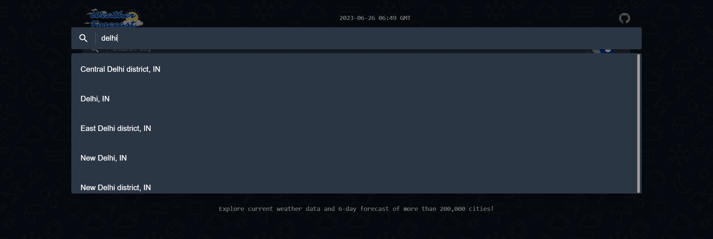

# Mausam ⚡[Live](https://mausam-kaisa.netlify.app/)

> **Note**
> The code is private. Please contact me on [WhatsApp](https://rkpassin132.github.io) if you require access to it.

## Introduction


### Finding current weather report of your city?

Introducing a weather web application that provides comprehensive information on atmospheric conditions. Discover the air quality index, today's forecast, and weekly predictions for any desired city.

## Compatibility:

| Platform | Supported |
| :------- | --------: |
| Android  |       Yes |
| Windows  |       Yes |
| Linux    |       Yes |
| Mac      |       Yes |

## Code at a glance

The table below shows the platform features used in the application and where abouts to find them in the sample.

### Frameworks

| Framework                                                     | Usage               |
| :------------------------------------------------------------ | :------------------ |
| [React](https://legacy.reactjs.org/docs/getting-started.html) | React for front-end |

### Libraries

| Library                                      | Usage         |
| :------------------------------------------- | :------------ |
| [Axios](https://www.npmjs.com/package/axios) | For api calls |
| [Material UI](https://mui.com/)              | For front-end |

### Website Feature

- City-based search functionality for quick access to weather data
- Air condition information, allowing users to monitor the quality of the air
- Daily forecast with up-to-date weather conditions, ensuring you stay prepared
- Weekly forecast, providing an overview of the upcoming weather patterns
- User-friendly interface, making navigation and information retrieval effortless
- Accurate and reliable data sourced from trusted weather APIs
- Mobile-responsive design, enabling seamless access from any device
- Intuitive user experience, allowing users to effortlessly explore weather details
- Regular updates and improvements to enhance performance and user satisfaction

### App features [(more image)](images/)

| Features                                                                                                        |
| :-------------------------------------------------------------------------------------------------------------- |
| Default page                                                                                                    |
| [](images/1.png)         |
| Search city                                                                                                     |
| [](images/2.png)        |
| Weather report of city in dark mode                                                                             |
| [](images/3.png) |
| Weather report of city in light mode                                                                            |
| [](images/4.png) |

## Some commands

```shell
$ npm start # local run
$ npm run build # build project to deploy
```

### Some important links
1. [Cities DB Api](https://rapidapi.com/wirefreethought/api/geodb-cities/)
2. [Weather Api](https://home.openweathermap.org/api_keys)